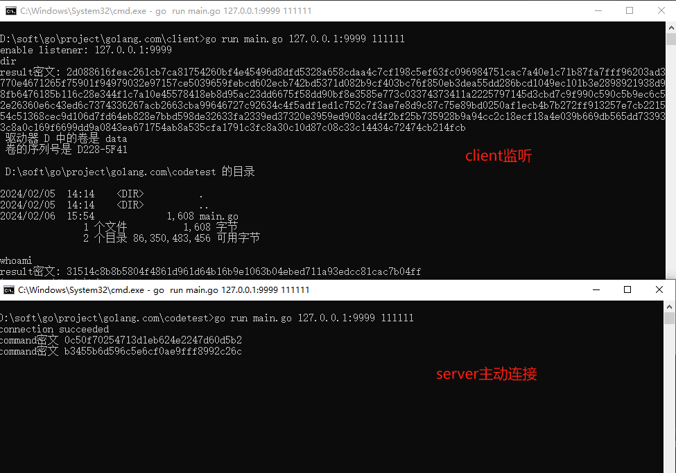
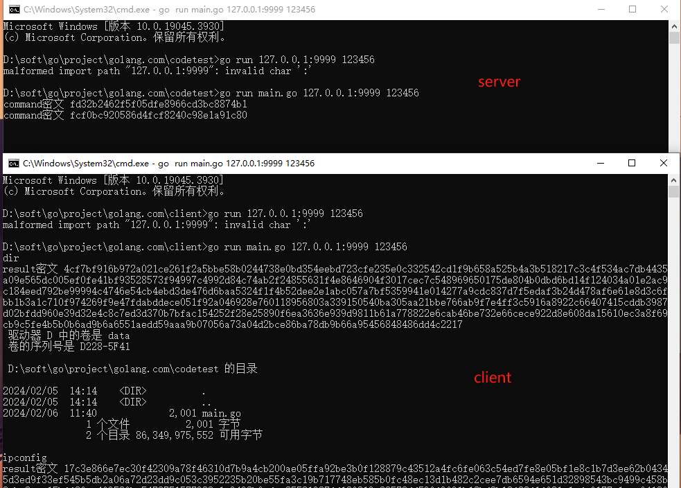

# tcpshell_AES
TCP forward and reverse shell, transmission implements AES encryption]

#### reverse_shell

#### bind_shell

#### 实现步骤

- 使用net.Listen实现端口监听，listener.Accept接受连接
- 使用bufio.NewScanner扫描conn中传输的数据以及用户输入的command
- 使用conn.Write()进行数据的发送
- 使用crypto/aes库进行aes加密，aeskey为初始key进行md5
- 使用os.Args获取终端输出的参数
